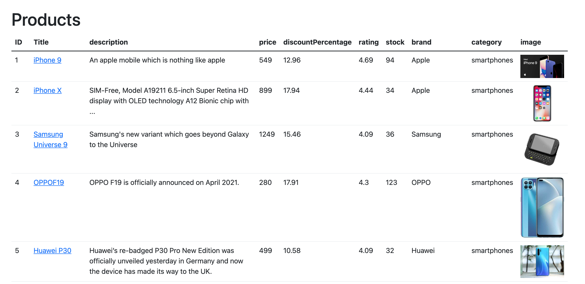
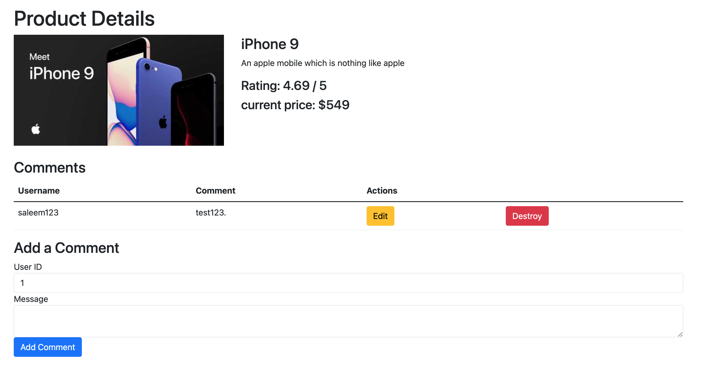

# Take Home Assignment

This project is a simple web application built with Ruby on Rails and Dockerized for development ease. It uses PostgreSQL as its database. 

In this app I am getting the products data from the dummyjson api and using that I have implemented a functionality for users to share their thoughts about a specific product by adding a comment to it. I am saving the users and comments data in our database, so that it can be displayed later to other users on the product show page. A user can also edit or delete his/her comments.

## Technology Stack

 - Framework: Ruby on Rails 7.0
 - Database: PostgreSQL
 - API: dummyjson products API (https://dummyjson.com/docs/products)

## Prerequisites

- Docker
- Docker Compose

## Getting Started

1. **Clone the Repository**:
   ```bash
   git clone https://github.com/MuhammadMurtza/products-assessment.git
   cd take-home
   create a .env file and copy content from .env.example to it
   ```
2. **Build the Docker Images**:
   ```bash
   docker-compose build
   ```
3. **Initialize the Database**:
   - Before starting the application for the first time, ensure that the database is set up correctly.
   ```bash
   docker-compose up -d db
   docker-compose run web rails db:create db:migrate
   ```
   - Now run the application with
   ```bash
   docker-compose up
## Models and Relationships
   - Product: Represents a product fetched from the dummyjson API (Not storing it in our DB).
   - Comment: Represents user comments. Each comment belongs to a product.
## Features
   - List Products: View a list of products fetched from the dummyjson API.
   - View Product: Click on a product title to go to show page.
   - Add Comment to Product: Users can add comments to a specific product.
## UI
   **Products page**
   

   **Product Show page**
   
